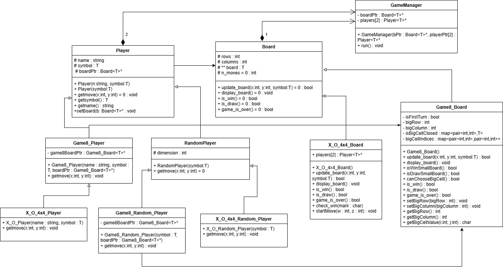

# Tic-Tac-Toe Games Collection

## Overview
The **Tic-Tac-Toe Games Collection** is a C++ console-based project that features multiple variations of Tic-Tac-Toe, each with unique gameplay mechanics. The system allows players to choose different game modes, including standard Tic-Tac-Toe, Pyramid Tic-Tac-Toe, Numerical Tic-Tac-Toe, and Ultimate Tic-Tac-Toe, among others. Players can compete against each other or against AI-controlled opponents.

## Features
- **Multiple Game Modes:** Includes various Tic-Tac-Toe variants, each with different rules and board configurations.
- **Human & AI Players:** Players can compete against human opponents or AI-based random and smart computer players.
- **Dynamic Game Selection:** Users can select a game mode from a menu and configure player types.
- **Board Display & Status Tracking:** The game boards are displayed with real-time updates, and the system tracks game states like wins, draws, and ongoing matches.

## Available Game Modes
1. **Pyramid Tic-Tac-Toe**
2. **Four-in-a-Row Tic-Tac-Toe**
3. **5x5 Tic-Tac-Toe**
4. **Word Tic-Tac-Toe**
5. **Numerical Tic-Tac-Toe**
6. **Misere Tic-Tac-Toe**
7. **4x4 Tic-Tac-Toe**
8. **Ultimate Tic-Tac-Toe**

## Installation & Usage
### Prerequisites
- C++ Compiler (g++, Clang, or MSVC)
- Any C++-compatible IDE (VS Code, CLion, Code::Blocks, etc.)

## File Structure
- `main.cpp` - Contains the main game loop and menu selection logic.
- `BoardGame_Classes.h` - Defines the base classes for boards and players.
- `Game1.h` to `Game8.h` - Implements various Tic-Tac-Toe game modes.
- `FourInARow_Board.h` - Defines the mechanics of the Four-in-a-Row variant.
- `NumberTicTacToe.h` - Implements the Numerical Tic-Tac-Toe variation.
- `3x3X_O_Mis.h`, `4x4X_O.h`, `5x5X_O.h` - Define different board sizes for classic Tic-Tac-Toe.

## Future Enhancements
- Add a **GUI interface** for a better user experience.
- Implement **database support** to store game results and player statistics.
- Introduce **more AI difficulty levels** for competitive gameplay.

## Class Design

The following UML diagram illustrates the class structure of the project:

## Contributors
Salsabil Bahaa Eldin
Nagat Mohamed
Menna Samir

